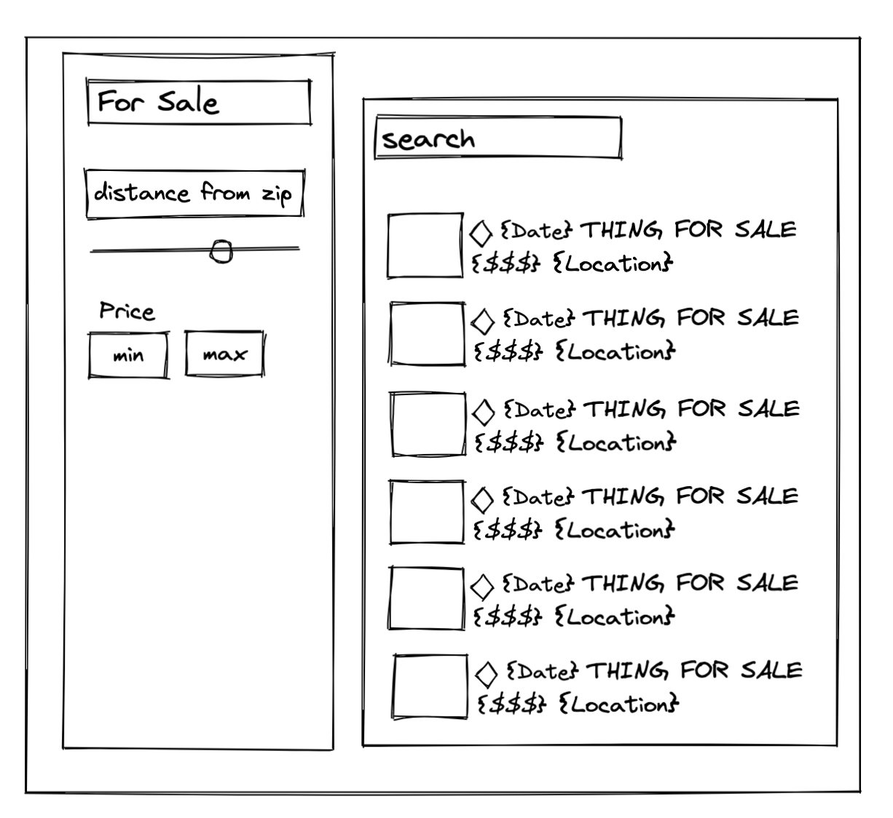
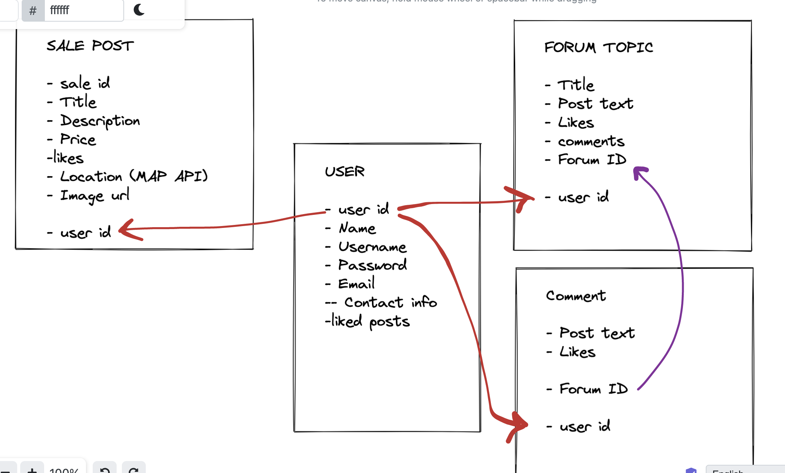
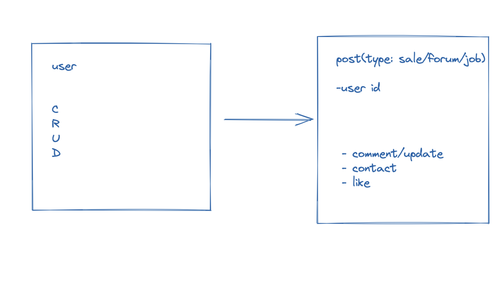

# ga-list


## Purpose of this application
To serve as a marketplace to buy, sell and enteract with the community. 

<!-- ## How does it work? -->


## Necessary Deliverables:
- A working app, built by the whole team, hosted somewhere on the internet
- A link to your hosted working app in the URL section of your Github repo
- ✅ A team git repository hosted on Github, with a link to your hosted project, and frequent commits from every team member dating back to the very beginning of the project.
- A readme.md file with:
Include a screenshot of the site in repo's README
Explanations of the technologies used
A couple paragraphs about the general approach you took
Installation instructions for any dependencies
- Link to your user stories – who are your users, what do they want, and why?
- Link to your wireframes – sketches of major views / interfaces in your application
- Descriptions of any unsolved problems or major hurdles your team had to overcome.


<!-- ## Screenshots -->

## Explanations of the technologies used
This was built using the MERN stack.


<!-- ## A couple paragraphs about the general approach you took -->


## ERD & WIREFRAME







## USER STORIES
### As a user I want to...
1. Access the home page (without logging in).
2. To browse listings (without logging in).
3. To log in (optional).
4. To create and manage my own posts (have to be logged in).

<!-- ### Additional details
- Who this is for: 
- What this is for: 
- Why:  -->

<!-- ## Code Snippets -->


<!-- ## Descriptions of any unsolved problems or major hurdles your team had to overcome. -->

# GA-LIST Frontend

Include a screenshot of the site in repo's README

Explanations of the technologies used. 

For our third project we built a Full Stack web app.

Mongoose
Express
React
Node

A couple paragraphs about the general approach you took

-We made a MERN app that resembles the famous website Craigslist. 

Link to your user stories – who are your users, what do they want, and why?

  = Our users are people who want to post job and sale offers, or respond to a growing marketplace. They access the home page to browse listings. 

Link to your wireframes – sketches of major views / interfaces in your application


Descriptions of any unsolved problems or major hurdles your team had to overcome.

PROBLEMS/BLOCKERS:

Figuring out efficient schemas
Careful planning
Communicating between front end and backend 


Installation instructions for any dependencies
# Getting Started with Create React App

This project was bootstrapped with [Create React App](https://github.com/facebook/create-react-app).

## Available Scripts

In the project directory, you can run:

### `npm start`

Runs the app in the development mode.\
Open [http://localhost:3000](http://localhost:3000) to view it in your browser.

The page will reload when you make changes.\
You may also see any lint errors in the console.

### `npm test`

Launches the test runner in the interactive watch mode.\
See the section about [running tests](https://facebook.github.io/create-react-app/docs/running-tests) for more information.

### `npm run build`

Builds the app for production to the `build` folder.\
It correctly bundles React in production mode and optimizes the build for the best performance.

The build is minified and the filenames include the hashes.\
Your app is ready to be deployed!

See the section about [deployment](https://facebook.github.io/create-react-app/docs/deployment) for more information.

### `npm run eject`

**Note: this is a one-way operation. Once you `eject`, you can't go back!**

If you aren't satisfied with the build tool and configuration choices, you can `eject` at any time. This command will remove the single build dependency from your project.

Instead, it will copy all the configuration files and the transitive dependencies (webpack, Babel, ESLint, etc) right into your project so you have full control over them. All of the commands except `eject` will still work, but they will point to the copied scripts so you can tweak them. At this point you're on your own.

You don't have to ever use `eject`. The curated feature set is suitable for small and middle deployments, and you shouldn't feel obligated to use this feature. However we understand that this tool wouldn't be useful if you couldn't customize it when you are ready for it.

## Learn More

You can learn more in the [Create React App documentation](https://facebook.github.io/create-react-app/docs/getting-started).

To learn React, check out the [React documentation](https://reactjs.org/).


APP Breakdown

| Components | Links to Code | Description |
| --- | --- | --- |
| `App`| [`App`](https://github.com/SEI-1025/mern-authentication-frontend#app-component) | The component that manages the entire app |
| `Signup`| [`Signup`](https://github.com/SEI-1025/mern-authentication-frontend/blob/main/docs/signup.md) | Allow the user to signup |
| `Login`| [`Login`](https://github.com/SEI-1025/mern-authentication-frontend/blob/main/docs/login.md) | Allows the user to login to the app |
| `Navbar`| [`Navbar`](https://github.com/SEI-1025/mern-authentication-frontend/blob/main/docs/navbar.md) | A navbar that displays the links based on if the user is logged in or not |
| `Profile`| [`Profile`](https://github.com/SEI-1025/mern-authentication-frontend/blob/main/docs/profile.md) | A component that displays the user profile information |
| `setAuthToken`| [`setAuthToken`](https://github.com/SEI-1025/mern-authentication-frontend/blob/main/docs/setAuthToken.md) | A utility function that adds a token to the `Authentication` header to manage current user |
| `Post Form`| [`PostForm`](https://github.com/kyleisme14/ga-list/blob/main/src/components/PostForm.js) | A component that allows posting to the database. |
| `Jobs`| [`JobsContainer`](https://github.com/kyleisme14/ga-list/blob/main/src/components/JobContainer.js) | A component displays the jobs from the database. |
| `Footer`| [`Footer`](https://github.com/SEI-1025/mern-authentication-frontend/blob/main/docs/other-components.md#footer) | A footer that goes on each component |
| `HomePage`| [`HomePage`](https://github.com/kyleisme14/ga-list/blob/main/src/components/HomePage.js) | A welcome page for the user |

### `App` Component

### Imports for `App`

```jsx
// Imports
import React, { useEffect, useState } from 'react';
import { Route, Switch, Redirect } from 'react-router-dom';
import jwt_decode from 'jwt-decode';
import setAuthToken from './utils/setAuthToken';

// CSS
import './App.css';

// Components
import Signup from './components/Signup';
import Footer from './components/Footer';
import Login from './components/Login';
import Navbar from './components/Navbar';
import Profile from './components/Profile';
import Sale from "./components/Sale";
import SaleContainer from "./components/SaleContainer";
import Job from "./components/Job";
import JobContainer from "./components/JobContainer";
import HomePage from "./components/HomePage";
import JobPostForm from "./components/PostForm";
import SalePostForm from "./components/SalePostForm";
import ForumPostForm from "./components/ForumPostForm";
```

### `useState` inside `App`

```jsx
function App() {
  // Set state values
  const [currentUser, setCurrentUser] = useState('');
  const [isAuthenticated, setIsAuthenticated] = useState(true);
}
```

### `PrivateRoute`

```jsx
const PrivateRoute = ({ component: Component, ...rest}) => {
  let token = localStorage.getItem('jwtToken');
  console.log('===> Hitting a Private Route');
  return <Route {...rest} render={(props) => {
    return token ? <Component {...rest} {...props} /> : <Redirect to="/login"/>
  }} />
}
```

### `useEffect` inside `App`

```jsx
useEffect(() => {
    let token;

    if (!localStorage.getItem('jwtToken')) {
      setIsAuthenticated(false);
      console.log('====> Authenticated is now FALSE');
    } else {
      token = jwt_decode(localStorage.getItem('jwtToken'));
      setAuthToken(localStorage.getItem('jwtToken'));
      setCurrentUser(token);
    }
  }, []);
```

### `nowCurrentUser`

```jsx
const nowCurrentUser = (userData) => {
    console.log('===> nowCurrentUser is here.');
    setCurrentUser(userData);
    setIsAuthenticated(true);
}
```

### `handleLogout`

```jsx
const handleLogout = () => {
    if (localStorage.getItem('jwtToken')) {
        // remove token for localStorage
        localStorage.removeItem('jwtToken');
        setCurrentUser(null);
        setIsAuthenticated(false);
    }
}
```

### `return` of `App`

```jsx
  return (
    <div className="App">
      <Navbar handleLogout={handleLogout} isAuth={isAuthenticated} />
      <div className="container mt-5">
        <Switch>
          <Route path='/signup' component={Signup} />
          <Route
            path="/login"
            render={(props) => <Login {...props} nowCurrentUser={nowCurrentUser} setIsAuthenticated={setIsAuthenticated} user={currentUser} />}
          />
          <PrivateRoute path="/profile" component={Profile} user={currentUser} handleLogout={handleLogout} />
          <Route exact path="/" component={HomePage} />
          <Route path="/sales" component={SaleContainer} />
          <Route path="/jobs" component={JobContainer} />
          <Route path="/jobs/:id" element={<Job />} />
          <Route path="/sales/:id" element={< Sale />} />
          <Route path="/jobpostform" component={JobPostForm} />
          <Route path="/salepostform" component={SalePostForm} />
          <Route path="/forumpostform" component={ForumPostForm} />
        </Switch>
      </div>
      <Footer />
    </div>
  );
}
```

### Finished

```jsx
// Imports
import React, { useEffect, useState } from 'react';
import { Route, Switch, Redirect } from 'react-router-dom';
import jwt_decode from 'jwt-decode';
import setAuthToken from './utils/setAuthToken';

// CSS
import './App.css';

// Components
import Signup from './components/Signup';
import Footer from './components/Footer';
import Login from './components/Login';
import Navbar from './components/Navbar';
import Profile from './components/Profile';
import Sale from "./components/Sale";
import SaleContainer from "./components/SaleContainer";
import Job from "./components/Job";
import JobContainer from "./components/JobContainer";
import HomePage from "./components/HomePage";
import JobPostForm from "./components/PostForm";
import SalePostForm from "./components/SalePostForm";
import ForumPostForm from "./components/ForumPostForm";

const PrivateRoute = ({ component: Component, ...rest }) => {
  let token = localStorage.getItem('jwtToken');
  // console.log('===> Hitting a Private Route');
  return <Route {...rest} render={(props) => {
    return token ? <Component {...rest} {...props} /> : <Redirect to="/login" />
  }} />
}


function App() {
  // Set state values
  const [currentUser, setCurrentUser] = useState('');
  const [isAuthenticated, setIsAuthenticated] = useState(true);

  useEffect(() => {
    let token;

    if (!localStorage.getItem('jwtToken')) {
      setIsAuthenticated(false);
      // console.log('====> Authenticated is now FALSE');
    } else {
      token = jwt_decode(localStorage.getItem('jwtToken'));
      setAuthToken(localStorage.getItem('jwtToken'));
      setCurrentUser(token);
    }
  }, []);

  const nowCurrentUser = (userData) => {
    // console.log('===> nowCurrentUser is here.');
    setCurrentUser(userData);
    setIsAuthenticated(true);
  }

  const handleLogout = () => {
    if (localStorage.getItem('jwtToken')) {
      // remove token for localStorage
      localStorage.removeItem('jwtToken');
      setCurrentUser(null);
      setIsAuthenticated(false);
    }
  }

  return (
    <div className="App">
      <Navbar handleLogout={handleLogout} isAuth={isAuthenticated} />
      <div className="container mt-5">
        <Switch>
          <Route path='/signup' component={Signup} />
          <Route
            path="/login"
            render={(props) => <Login {...props} nowCurrentUser={nowCurrentUser} setIsAuthenticated={setIsAuthenticated} user={currentUser} />}
          />
          <PrivateRoute path="/profile" component={Profile} user={currentUser} handleLogout={handleLogout} />
          <Route exact path="/" component={HomePage} />
          <Route path="/sales" component={SaleContainer} />
          <Route path="/jobs" component={JobContainer} />
          <Route path="/jobs/:id" element={<Job />} />
          <Route path="/sales/:id" element={< Sale />} />
          <Route path="/jobpostform" component={JobPostForm} />
          <Route path="/salepostform" component={SalePostForm} />
          <Route path="/forumpostform" component={ForumPostForm} />
        </Switch>
      </div>
      <Footer />
    </div>
  );
}

export default App;

```
